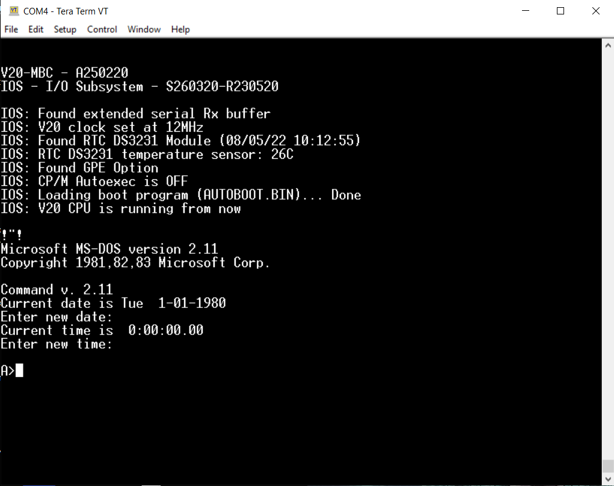

# MSDOS 2.11 adapted for the Just for Fun v20mbc
** Requires 512KB

IMPORTANT: The files in this repository are under a variety of licenses. 
IMPORTANT: No warranty given, no liability accepted if you chose to use this
IMPORTANT: WARNING: Here be bugs aplenty. 

Want to just run it and not build it? See rdy2run directory

Hardware and firmware:

https://j4f.info/v20-mbc

Set up for building on win32, can build on other platforms
Just need an assembler. 

Buildable MSDOS source obtained from pcjs

https://www.pcjs.org/blog/2018/11/21/

Derived from MS repo

https://github.com/microsoft/MS-DOS

You will need dosbox-x

https://dosbox-x.com/

## Build Loader
Win32 nasm is included. Use a nasm for your platform. 

build loader with nasm: 
    nasm loader.asm -fbin

copy loader.asm to autoboot.bin

## Customize Bios
Edit skelio.asm to your tastes, primarily to set max memory size - 
* bios size in paragraphs is used to calculate location of msdos.sys
* A paragraph is 16 bytes.
* Since loader loads logical sectors, this is the position of msdos in memory
* The fat12 format used is 8 sectors/cluster. 
* msdos will be 512*8 bytes after start of bios
** If your bios becomes larger than 4kb, this will be 512*16 **
 ** You may need to alter the loader to load more sectors ** 

*Bios size - this allows moving msdos.sys to just after the  bios to save some bytes of memory. I am currently wasting space

*Bios segment - this is where the loader places the bios, my loader uses 00C0

If you change the boot block definition, you will need to alter seltrack to account for a different sectors per track *The value is hard coded in the function*

## Build Image
* Run dosbox-x with the build-msdos.cfg
* Run dosbox-x with the build-image.cfg

* This is not automatic. Input is needed. Watch for errors*

* AT PROMPT SEGMENT NEEDED ENTER YOUR BIOS SEGMENT (00C0)*
 
## Run image
copy autoboot.bin and ds00n00.dsk & ds01n00.dsk to v20mbc 	
Follow directions in rdy2run

## Adding software##

mount the disk image in dosbox-x:
	imgmount f ds1n00.dsk -t hdd -fs fat

You can now copy files to the image. Close dosbox-x and recopy to SD. 